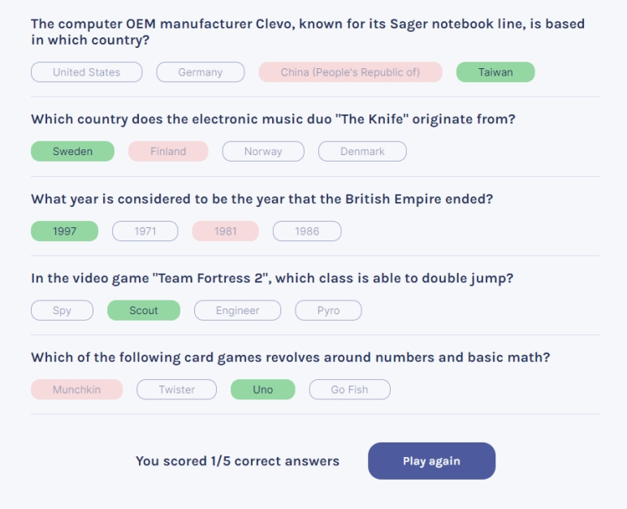

## Quiz App 

### Built in React

### Scrimba solo project - [React basics course by Bob Ziroll](https://scrimba.com/learn/learnreact)

**Project page**:

[Quizzical - netlify link](https://quiz-app-agnkos.netlify.app/)

 

#### Project description:
- Two screens (start & questions)
- Pull 5 questions from [OTDB API](https://opentdb.com/api_config.php)
- Figma design [link](https://www.figma.com/file/E9S5iPcm10f0RIHK8mCqKL/Quizzical-App?node-id=0%3A1)

